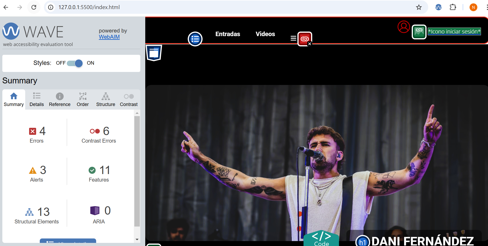
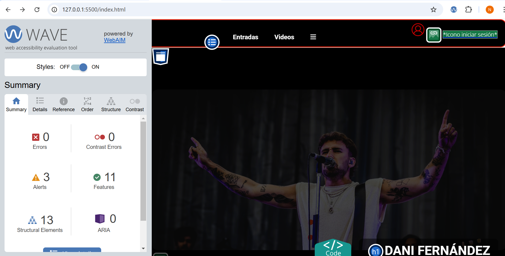
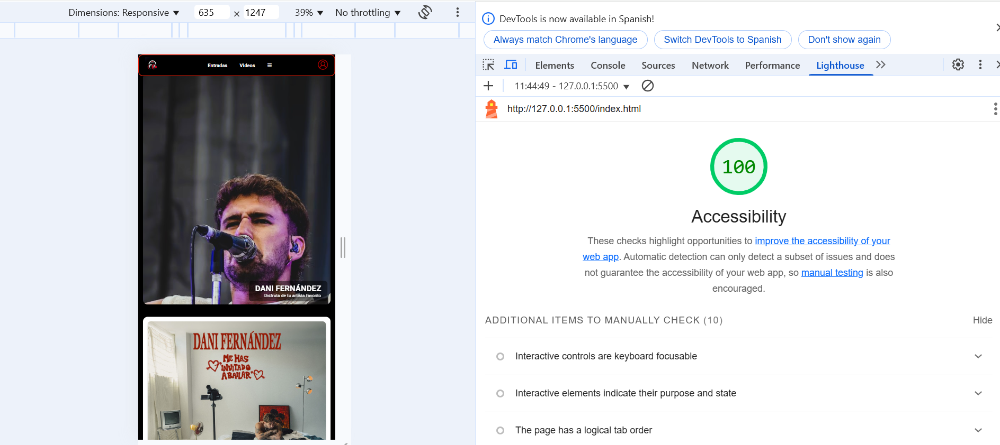

# Proyecto de Accesibilidad Web | Web Accessibility Project

## Español

### Proceso de desarrollo

En este proyecto, vamos a coger una página web que ya tengo creada. El objetivo principal es mejorar la accesibilidad y corregir errores para que sea más accesible para personas con discapacidad, utilizando las pautas de accesibilidad web.

### Pasos seguidos para validar la accesibilidad

1. **Validación inicial**:
   Usamos las herramientas **WAVE** y **Lighthouse** para realizar una validación inicial de accesibilidad en cada uno de los archivos HTML antes de aplicar mejoras. Esto nos proporcionó un informe sobre los errores y advertencias de accesibilidad.

### Problemas encontrados y soluciones aplicadas

Durante la validación inicial, se identificaron los siguientes problemas comunes de accesibilidad:
- **Falta de texto en los links**: El enlace (<a>) del menú y de las redes sociales no tienen texto visible, solo un icono. Esto puede ser un problema de accesibilidad, ya que los lectores de pantalla pueden no interpretar correctamente el propósito del enlace. Solución: Agregar un texto oculto solo para lectores de pantalla.
- **Contraste bajo en los botones de los vídeos** Cambiamos el fondo a #C20000 (rojo oscuro) para mejorar la relación de contraste.

### Enlace a las capturas de pantalla

**Antes**

**Después**

**Accesibilidad**

# Web Accessibility Project  

## English  

### Development Process  

In this project, we are taking an existing website that I created. The main goal is to improve accessibility and fix errors to make it more accessible for people with disabilities, following web accessibility guidelines.  

### Steps Taken to Validate Accessibility  

1. **Initial Validation**:  
   We used the **WAVE** and **Lighthouse** tools to perform an initial accessibility validation on each of the HTML files before making improvements. This provided us with a report on accessibility errors and warnings.  

### Issues Found and Solutions Applied  

During the initial validation, the following common accessibility issues were identified:  

- **Missing text in links**: The `<a>` elements in the menu and social media links had no visible text, only an icon. This can be an accessibility issue, as screen readers may not correctly interpret the purpose of the link.  
  - **Solution**: Added hidden text that is only readable by screen readers.  

- **Low contrast in video buttons**:  
  - **Solution**: Changed the background color to `#C20000` (dark red) to improve contrast ratio.  

### Screenshots  

**Before**  

**After**  

**Accessibility**

